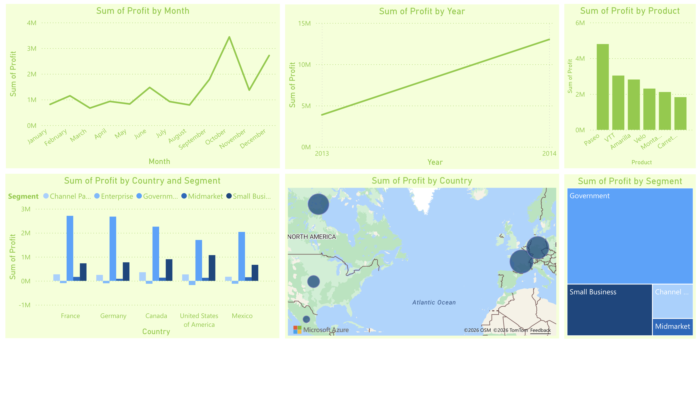

# Product Sales Data Analysis Dashboard

An interactive Power BI dashboard built using Microsoft's Financial Sample dataset to analyze sales performance, profitability trends, product performance, and regional insights.

This project demonstrates business intelligence concepts including:
- Profit trend analysis
- Product profitability comparison
- Geographic sales visualization
- Segment-level analysis
- Executive KPI reporting

The dashboard was created using Power BI, Power Query, and DAX.

---

## Dashboard Preview



---

## Project Overview

Businesses rely on sales analytics to monitor profitability, identify growth opportunities, and make informed strategic decisions.

This project transforms raw financial sales data into an interactive dashboard that helps stakeholders:

- Monitor financial performance
- Compare regional profitability
- Identify top-performing products
- Detect seasonal sales trends
- Analyze business segment contribution
- Support executive decision-making

---

## Dataset

Dataset Source:
Microsoft Financial Sample Dataset

The dataset contains:
- Sales
- Profit
- Gross Sales
- Discounts
- Product information
- Country and segment data
- Manufacturing price
- Transaction dates

---

## Tools & Technologies

- Power BI Desktop
- Power Query
- DAX (Data Analysis Expressions)
- Microsoft Financial Sample Dataset

---

## Dashboard Features

### 1. Profit Trend Analysis

Visualizations included:
- Monthly profit trend line chart
- Year-over-year profit analysis
- Seasonal profitability insights

### 2. Product Profitability Analysis

Bar charts displaying:
- Profit by product
- High-performing products
- Comparative product profitability

### 3. Country & Segment Analysis

Clustered charts showing:
- Profit distribution by country
- Segment-wise business contribution
- Regional performance comparison

### 4. Geographic Profit Distribution

Interactive world map visualization:
- Country-level profit analysis
- Geographic business opportunities
- Regional market insights

### 5. Segment Performance Analysis

Treemap visualization showing:
- Profit by segment
- Strong vs weak business segments
- Revenue concentration analysis

---

## Key Insights

- Profit increased significantly from 2013 to 2014
- October generated the highest monthly profit
- Paseo is the highest-profit product
- Government segment contributes the largest share of profit
- France and Germany show strong profitability across segments

---

## Dashboard Visuals

### Monthly Profit Trend
Tracks monthly fluctuations in profitability to identify seasonality and growth patterns.

### Yearly Profit Trend
Compares yearly financial performance and business growth.

### Profit by Product
Highlights top-performing and low-performing products.

### Profit by Country & Segment
Shows profitability distribution across countries and business segments.

### Global Profit Map
Visualizes geographic profit distribution using map visuals.

### Segment Treemap
Displays segment contribution to overall profitability.

---

## DAX Measures Used

### Total Profit

```DAX
Total Profit = SUM(financials[Profit])
```

### Total Sales

```DAX
Total Sales = SUM(financials[Sales])
```

### Gross Sales

```DAX
Gross Sales = SUM(financials[Gross Sales])
```

### Profit Margin

```DAX
Profit Margin = DIVIDE([Total Profit], [Total Sales], 0)
```

### Total Discounts

```DAX
Total Discounts = SUM(financials[Discounts])
```

### Units Sold

```DAX
Units Sold = SUM(financials[Units Sold])
```

---

## Repository Structure

```text
product-sales-data-analysis-powerbi/
│
├── README.md
├── LICENSE
├── .gitignore
│
├── dashboard/
│   └── Product_Sales_Analysis.pbix
│
├── data/
│   └── Financial_Sample.xlsx
│
├── screenshots/
│   ├── dashboard-overview.png
│   ├── monthly-profit-trend.png
│   ├── yearly-profit-trend.png
│   ├── product-profit-analysis.png
│   ├── country-segment-analysis.png
│   ├── global-profit-map.png
│   └── segment-treemap.png
│
└── docs/
    └── dax-measures.md
```

---

## Business Value

This dashboard helps organizations:

- Improve strategic planning
- Identify profitable products
- Optimize regional investments
- Monitor financial performance
- Support data-driven decision-making

---

## Future Improvements

Potential future enhancements:
- Sales forecasting
- Customer segmentation analysis
- Real-time data integration
- KPI scorecards
- Power BI Service deployment
- Drill-through analysis pages

---

## How to Use

1. Download the `.pbix` file from the `dashboard/` folder
2. Open in Power BI Desktop
3. Refresh the dataset if needed
4. Interact with filters and visuals

---

## Author

Amber Betts

GitHub: https://github.com/amber3905

---

## License

This project is licensed under the MIT License.
